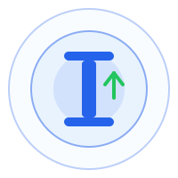
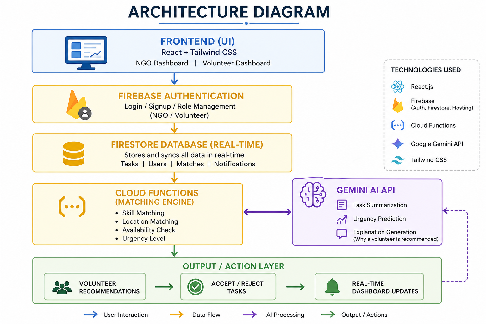

<div align="center">
  

  <h1>🌍 Impact</h1>
  <p><strong>Winner-Worthy Hackathon Submission</strong></p>
  <p><em>AI-Powered Resource & Volunteer Allocation for Social Impact Organizations</em></p>
  <p><strong><a href="https://impact-da12c.web.app" target="_blank">🚀 View Live Demo</a></strong></p>

  <p>
    
    
    
    
    
  </p>
</div>

---

## 💡 Inspiration
During crises or even standard community drives, Non-Governmental Organizations (NGOs) often struggle with logistics. Volunteer databases are fragmented, task coordination is done manually on spreadsheets, and there's a significant delay between a crisis emerging and the right people arriving on the scene. We built **Impact** to solve this critical bottleneck. We wanted to build a bridge that connects the exact right skills to the most urgent community needs instantaneously.

## 🎯 What it does
**Impact** is a comprehensive, real-time coordination dashboard for NGOs and volunteers.
- **For NGOs:** Provides a command center to create tasks. Using **Google Gemini AI**, the platform automatically summarizes long descriptions of community needs, suggests an urgency priority level, and algorithmically matches the top 3 best-suited volunteers from the database.
- **For Volunteers:** Provides a personalized dashboard where they receive task requests matching their specific skills and location. They can review AI-generated reasoning on *why* they were selected, and accept or decline the mission with one click.

## 🏗️ Architecture

<div align="center">
  
</div>

## ⚙️ How we built it
We utilized a modern, lightning-fast tech stack heavily reliant on the **Google Cloud Ecosystem**:
- **Frontend:** Built with React 19 and Vite for a highly responsive, single-page application experience. Styled using Tailwind CSS v4 for a beautiful, modern UI.
- **Backend/Database:** Google Firebase (Authentication, Cloud Firestore NoSQL Database, Firebase Hosting).
- **Matching Engine:** A custom heuristic algorithm scoring volunteers based on Skill Match (50%), Location Proximity (20%), Availability (20%), and Task Urgency (10%).
- **AI Integration:** Google's `gemini-2.5-flash` model is deeply integrated directly into the task creation and matching workflows.

## 🧠 The AI Magic (Google Gemini Integration)
We didn't just add AI as an afterthought; it's central to the application's UX:
1. **Intelligent Summarization:** When NGOs type out messy, long-winded crisis descriptions, Gemini parses it into a clean, 2-3 sentence summary focused on the core problem.
2. **Urgency Classification:** Gemini analyzes the semantics of the task to automatically suggest whether the priority should be "Low", "Medium", or "High".
3. **Explainable Matching:** Instead of a black-box algorithm telling a volunteer to go somewhere, Gemini reads the volunteer's profile and the task requirements to generate a human-readable explanation of exactly *why* they are the perfect fit.

## 🏆 Challenges we ran into
- **Algorithm Weights:** Balancing the scoring weights between proximity, skills, and urgency was tough. We had to iterate on our Jaccard similarity implementation to ensure volunteers weren't spammed with irrelevant tasks just because they lived nearby.
- **Synchronous State Rendering:** Upgrading to React 19 introduced strict rules about state rendering inside `useEffect` hooks which required us to heavily refactor our data fetching layer to prevent cascading renders.
- **AI Fallbacks:** We had to implement a robust rule-based fallback system in case the Gemini API rate-limits or is unavailable, ensuring the application never breaks.

## 🚀 Accomplishments that we're proud of
- Successfully combining a deterministic heuristic scoring algorithm with non-deterministic LLM explanations.
- Building a seamless, real-time synchronization experience where volunteer acceptances instantly reflect on the NGO dashboard via Firestore listeners.
- Achieving a beautifully polished, hackathon-ready UI with zero complex state management libraries (Context API only).

## 📖 What we learned
- How to efficiently structure NoSQL data in Firestore to allow rapid querying of volunteer pools based on complex task requirements.
- Prompt engineering for the Gemini API to force strictly formatted outputs (like one-word urgency classifications) without the model hallucinating extra conversational text.

## ⏭️ What's next for Impact
- **Google Maps Integration:** Upgrading our exact-match location string comparison to actual geolocation-based radius routing.
- **SMS/WhatsApp Notifications:** Alerting volunteers instantly when they are matched to a High-Urgency task.
- **Volunteer Leaderboards:** Gamifying the experience to encourage more community participation.

---

## 🛠️ Local Setup & Installation

Want to run this locally or test it for judging? Follow these steps:

### 1. Clone the Repository
```bash
git clone https://github.com/ayush9085/Impact.git
cd Impact
```

### 2. Install Dependencies
```bash
npm install
```

### 3. Setup Firebase & Environment Variables
Create a `.env` file in the root directory:
```bash
cp .env.example .env
```
Populate it with your Firebase project config and a **Google Gemini API Key**:
```env
VITE_FIREBASE_API_KEY="your_api_key"
VITE_FIREBASE_AUTH_DOMAIN="your_project_id.firebaseapp.com"
VITE_FIREBASE_PROJECT_ID="your_project_id"
VITE_FIREBASE_STORAGE_BUCKET="your_project_id.appspot.com"
VITE_FIREBASE_MESSAGING_SENDER_ID="your_sender_id"
VITE_FIREBASE_APP_ID="your_app_id"
VITE_GEMINI_API_KEY="your_gemini_api_key_here"
```

### 4. Run the App!
```bash
npm run dev
```
Open `http://localhost:5173`. 
*Pro tip: Use the "Seed Demo Data" button on the NGO dashboard to instantly populate the database with tasks and volunteers!*

---
<div align="center">
  <b>Built with ❤️ for social good.</b>
</div>
